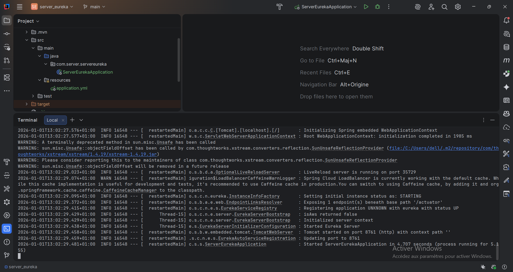
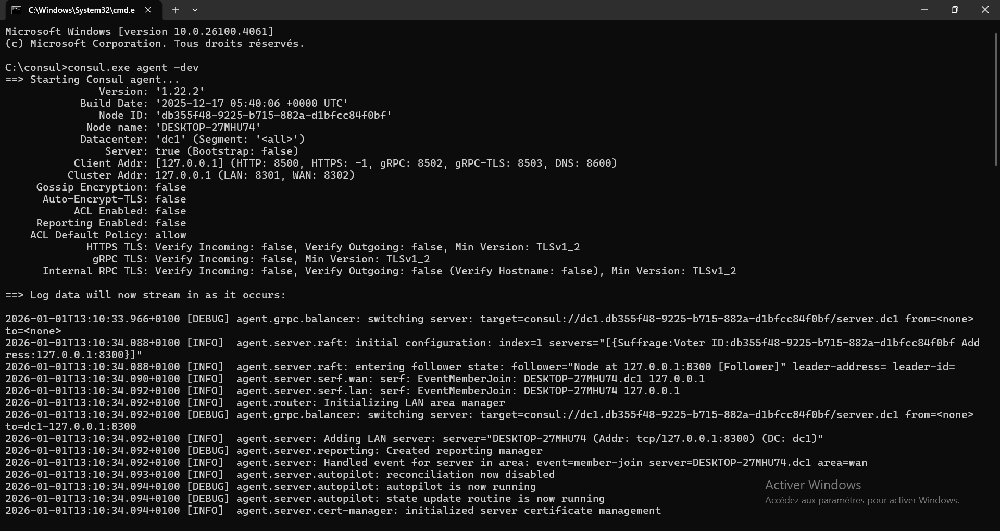
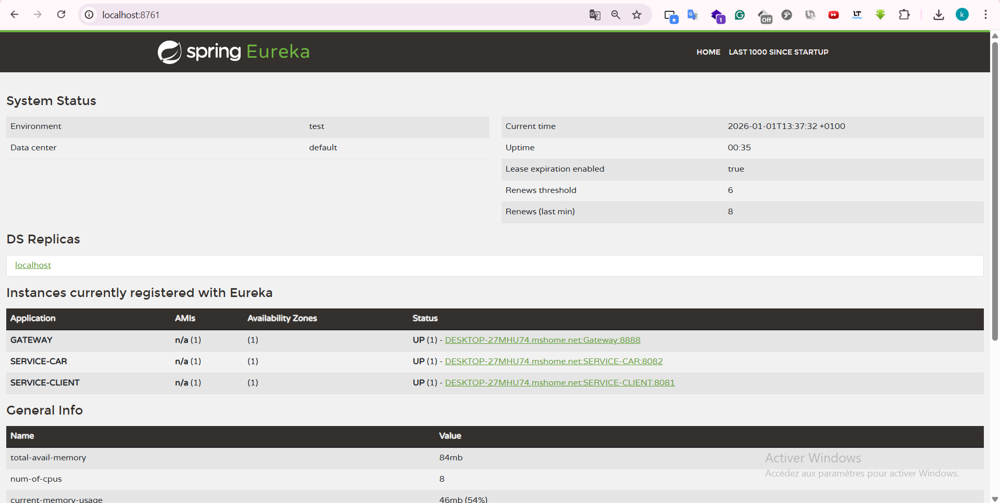
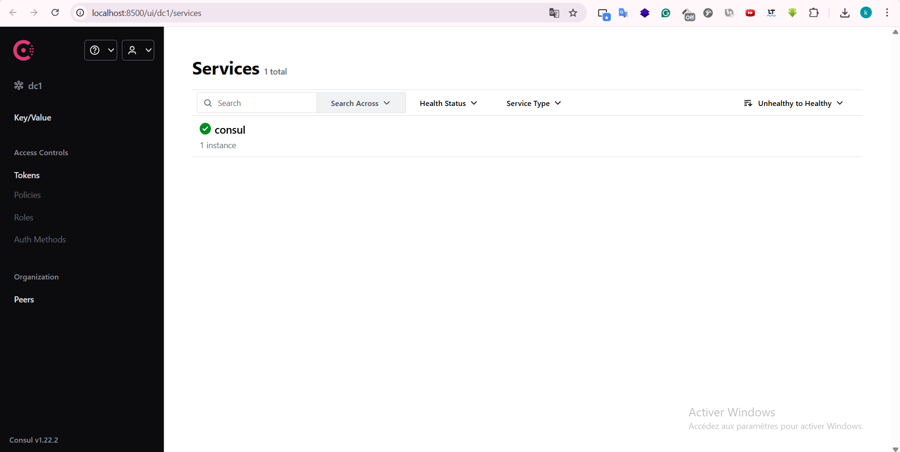
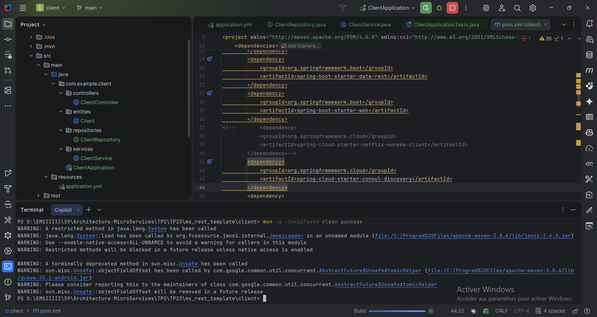
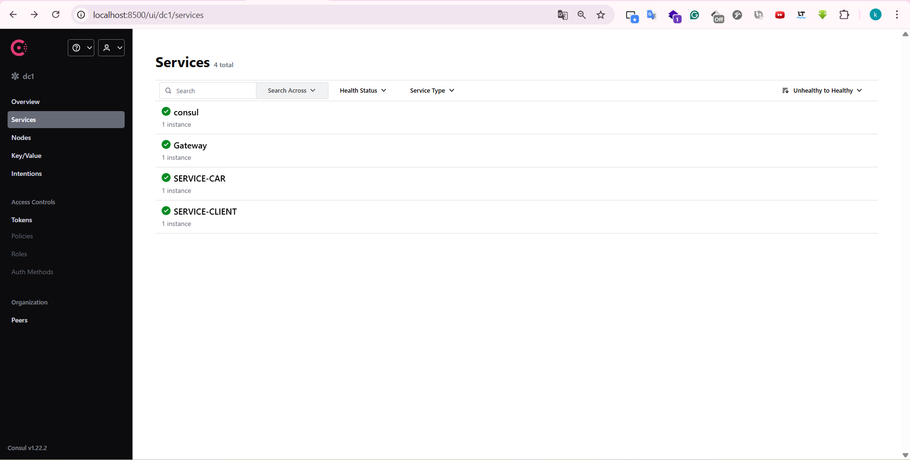

# TP 23 : Migration Eureka vers Consul

## 1. État Initial (Eureka)
Démarrage des microservices avec Eureka.

## 2. Installation Consul
Démarrage du serveur Consul en mode dev.

Serveur prêt.

Interface Web vide au démarrage.

## 3. Migration (Eureka -> Consul)
Changements : dépendances `consul-discovery` et config `application.yml`.

## 4. Résultat Final
Les services `SERVICE-CLIENT` et `SERVICE-GATEWAY` sont découverts par Consul.

